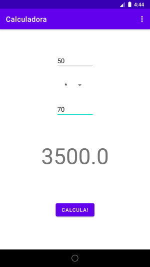
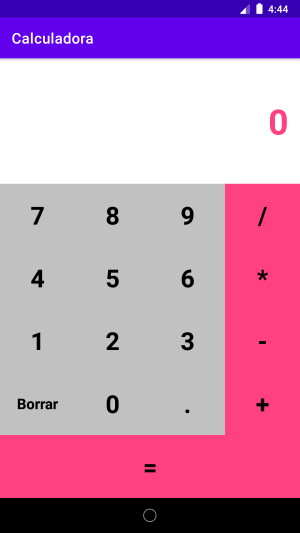

# Calculadora

Este proyecto consiste en una calculadora simple que dados dos operadores y elegida una operación, calcula su resultado. Su interfaz puede observarse en la siguiente figura. Incorpora además un menú con varias opciones: la calculadora simple y una pantalla acerca de.

Se pide añadir otra opción con una calculadora más real, con un aspecto como el que se muestra en la siguiente figura.

Para ello habrá que añadir una nueva actividad con su layout y añadirla al menú actual.

Como consejo para realizar la interfaz es recomendable utilizar un LinearLayout vertical compuesto de varios LinearLayout horizontales y utilizar valores de pesos para proporcionar los elementos en pantalla. Para usar pesos hay que indicar un tamaño 0 a la dimensión que queremos proporcionar (ancho o alto) y utilizar la propiedad de peso relativo con un valor 1, 2, etc. La suma de pesos total podemos indicarla o sino, la calculará como la suma de todos los que pongamos.

Su funcionalidad es la de una calculadora típica que incluye:

- Campo numérico con el resultado u operación actual.

- Botones numéricos del 0 al 9.

- Botón para añadir decimales (si no tiene ya decimales el actual).

- Botones para añadir operaciones. Ha de haber un número en el campo de resultado y que no se haya pulsado otro símbolo de operación previamente.

- Botón de igual, que sólo realizará la operación si está formada por dos operadores y un símbolo de operación.
